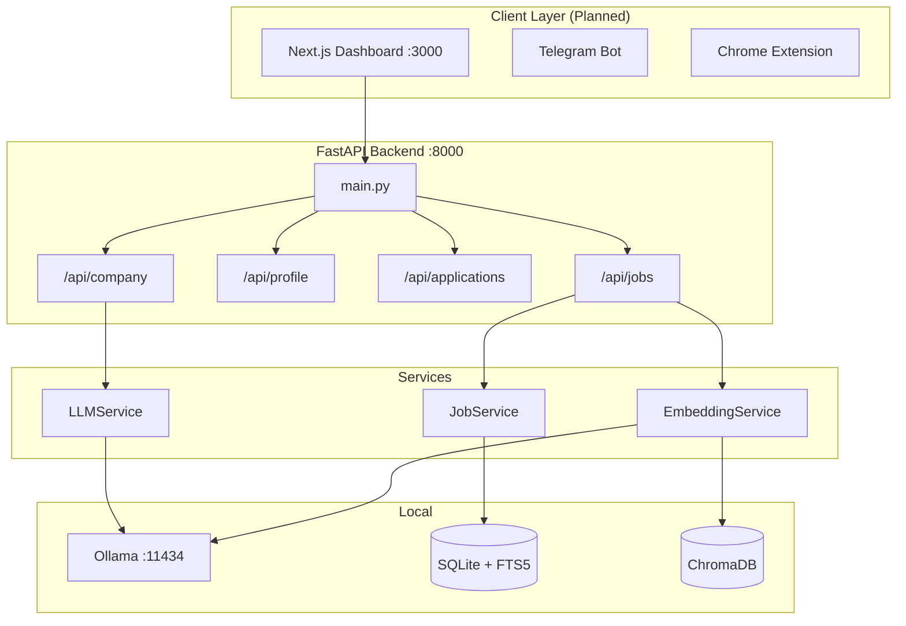
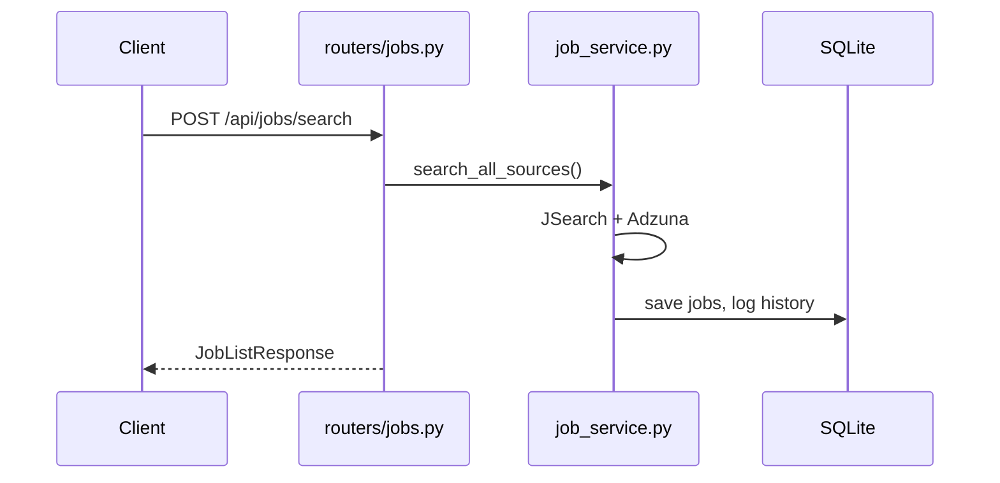
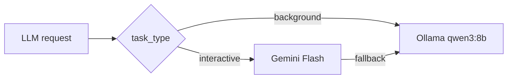
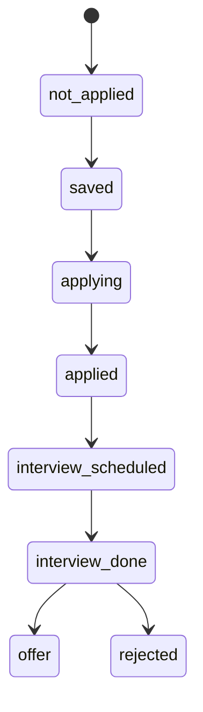
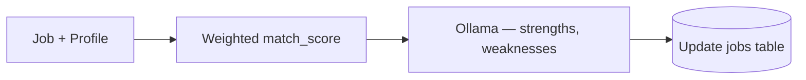
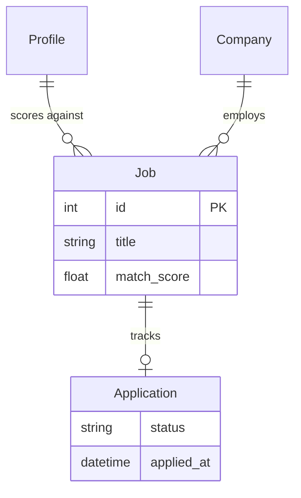

# CareerPilot AI

Personal AEM/EDS career assistant — job search, AI matching, resume tailoring, application tracking, and interview prep. Built as a single-user tool (no auth, no billing) optimized for AEM Developer / Architect roles in India and remote markets.

| Layer | Technology | Status |
|-------|------------|--------|
| Backend API | FastAPI + SQLAlchemy | Phase 1 complete |
| Database | SQLite (WAL) + FTS5 | Implemented |
| Vector search | ChromaDB + nomic-embed-text | Implemented |
| LLM (background) | Ollama `qwen3:8b` | Implemented |
| LLM (interactive) | Google Gemini Flash | Implemented |
| Job sources | JSearch, Adzuna | Implemented |
| Notifications | Telegram bot | Implemented |
| Frontend | Next.js dashboard | Planned (Phase 4) |
| Google Sheets sync | gspread | Planned (Phase 4) |

**Target profile:** AEM Developer / EDS Developer — Senior / Architect  
**Target salary:** ₹20–35 LPA (India) / $100K–150K (remote)  
**Default location:** Hyderabad, India

---

## Table of Contents

1. [Quick Start (5 Minutes)](#quick-start-5-minutes)
2. [Install Software](#install-software)
3. [Create Free API Accounts](#create-free-api-accounts)
4. [Configure Environment Variables](#configure-environment-variables)
5. [Run the Project](#run-the-project)
6. [Test That Everything Works](#test-that-everything-works)
7. [Architecture](#architecture)
8. [Tech Stack & Key Decisions](#tech-stack--key-decisions)
9. [How the Code Flows](#how-the-code-flows)
10. [Database & Data Model](#database--data-model)
11. [LLM Strategy](#llm-strategy)
12. [Job Search & Deduplication](#job-search--deduplication)
13. [Application Tracking](#application-tracking)
14. [API Reference](#api-reference)
15. [Daily Workflow](#daily-workflow)
16. [Project Status & Roadmap](#project-status--roadmap)
17. [Troubleshooting](#troubleshooting)
18. [FAQ](#faq)
19. [Verification Checklist](#verification-checklist)

---

## Quick Start (5 Minutes)

If software and API keys are already installed:

```powershell
# Terminal 1 — Ollama (skip if already running in system tray)
ollama serve

# Terminal 2 — Backend
cd careerpilot-ai\backend
python -m venv .venv
.\.venv\Scripts\Activate.ps1
pip install -r requirements.txt
uvicorn app.main:app --host 0.0.0.0 --port 8000 --reload
```

| URL | Purpose |
|-----|---------|
| http://localhost:8000/docs | Interactive API docs |
| http://localhost:8000/health | DB + Ollama + Gemini status |
| http://localhost:8000/api/profile/ | Your profile |
| http://localhost:8000/api/jobs/ | Job listings |

**Or** double-click `backend/start.bat` for one-click startup.

---

## Install Software

**Target machine:** Lenovo ThinkBook 14, i7, 16 GB RAM, Windows 11

### Check what you already have

```powershell
python --version    # Need 3.12+
node --version      # Need 20+ (for future frontend)
git --version
ollama --version
docker --version    # Optional
```

### Install required software

| # | Software | Why | Install |
|---|----------|-----|---------|
| 1 | **Python 3.12** | Backend | https://www.python.org/downloads/ — check **Add to PATH** |
| 2 | **Git** | Version control | https://git-scm.com/download/win or `winget install Git.Git` |
| 3 | **Ollama** | Local AI | https://ollama.com/download |
| 4 | **Node.js 20 LTS** | Future frontend | https://nodejs.org (optional for Phase 1) |
| 5 | **Docker Desktop** | Container deploy | https://docker.com (optional) |

### Pull Ollama models

```powershell
ollama pull nomic-embed-text   # 274 MB — embeddings
ollama pull qwen3:8b           # 5.2 GB — scoring & background AI
ollama list                    # Verify both models appear
```

### Speed on CPU (no GPU)

| Model | Task | Expected time |
|-------|------|---------------|
| nomic-embed-text | Generate embedding | < 1 second |
| qwen3:8b | Score one job | 10–20 seconds (background OK) |
| qwen3:8b | Tailor resume | 30–60 seconds — use Gemini instead |
| Gemini Flash | Interactive tasks | 2–3 seconds |

---

## Create Free API Accounts

**Total cost: ₹0.** No credit card required.

| # | Service | Purpose | Free tier | Get keys from |
|---|---------|---------|-----------|---------------|
| 1 | **JSearch (OpenWeb Ninja)** | Primary job search | ~200 req/month | https://app.openwebninja.com/api/jsearch |
| 2 | **Google Gemini** | Resume, research | 500 RPD | https://aistudio.google.com |
| 3 | **Adzuna** | Extra India jobs | Free tier | https://developer.adzuna.com |
| 4 | **Telegram Bot** | Job alerts | Free forever | @BotFather on Telegram |
| 5 | **Ollama** | Local LLM | Unlimited | No key — runs locally |

### JSearch (PRIMARY)

1. Go to https://app.openwebninja.com/api/jsearch → Sign up → Free plan → Copy API key

```powershell
$headers = @{ "x-api-key" = "YOUR_KEY_HERE" }
Invoke-RestMethod -Uri "https://api.openwebninja.com/jsearch/search-v2?query=AEM+developer+in+Hyderabad&country=in&num_pages=1" -Headers $headers
```

### Google Gemini

1. https://aistudio.google.com → API Keys → Create → Copy key (`AIza...`)
2. Restrict to **Generative Language API** only

### Adzuna

1. https://developer.adzuna.com → Sign up → Create app `careerpilot-ai` → Copy App ID + Key

### Telegram Bot

1. Telegram → **@BotFather** → `/newbot` → copy token
2. Message your bot → open `https://api.telegram.org/botYOUR_TOKEN/getUpdates` → copy chat `id`

---

## Configure Environment Variables

```powershell
copy .env.example backend\.env
# Edit backend\.env with your keys
```

The backend reads `backend/.env` (see `backend/app/config.py`).

```bash
OLLAMA_HOST=http://localhost:11434
GOOGLE_API_KEY=
JSEARCH_API_KEY=
JSEARCH_BASE_URL=https://api.openwebninja.com/jsearch
ADZUNA_APP_ID=
ADZUNA_APP_KEY=
TELEGRAM_BOT_TOKEN=
TELEGRAM_CHAT_ID=
APP_ENV=development
APP_URL=http://localhost:3000
API_URL=http://localhost:8000
SECRET_KEY=                              # python -c "import secrets; print(secrets.token_urlsafe(64))"
DATABASE_PATH=./data/careerpilot.db
```

**Never commit `.env` to git.**

---

## Run the Project

### First-time setup

```powershell
cd backend
python -m venv .venv
.\.venv\Scripts\Activate.ps1
pip install -r requirements.txt
ollama pull qwen3:8b
ollama pull nomic-embed-text
```

PowerShell blocked? `Set-ExecutionPolicy RemoteSigned -Scope CurrentUser`

### Start services

**Terminal 1:** `ollama serve` (or use system tray 🦙 icon)

**Terminal 2:**

```powershell
cd backend
.\.venv\Scripts\Activate.ps1
uvicorn app.main:app --host 0.0.0.0 --port 8000 --reload
```

### Daily (after first setup)

```powershell
cd backend
.\.venv\Scripts\Activate.ps1
uvicorn app.main:app --reload
```

### Docker Compose

```powershell
docker compose up --build
```

Services: backend `:8000`, ollama `:11434`.

### Tests

```powershell
cd backend
pytest tests/ -v    # Expected: 34 passed
```

---

## Test That Everything Works

**Health:** http://localhost:8000/health → `"status": "ok"`, `"ollama": "ready"`, `"gemini": "ready"`

**Job search** at `/docs` → **POST /api/jobs/search**:

```json
{ "query": "AEM developer", "location": "Hyderabad", "country": "in", "max_results": 10 }
```

**Company research** → **GET /api/company/research** → `company_name=Accenture`, `role=AEM Architect`

**Ollama:** `ollama run qwen3:8b "What are 3 key skills for an AEM architect?"`

---

## Architecture

```
┌─────────────────────────────────────────────────────────────────┐
│  Next.js Dashboard (:3000) — Phase 4                            │
│  FastAPI Backend (:8000) — Jobs, Profile, Applications, Research│
│  SQLite + FTS5 + ChromaDB │ Ollama (:11434) │ JSearch, Adzuna  │
│  Telegram Bot (Phase 4) │ Chrome Extension (Phase 5)            │
└─────────────────────────────────────────────────────────────────┘
```



### Project structure

```
careerpilot-ai/
├── backend/
│   ├── app/
│   │   ├── main.py, config.py, database.py, models.py, schemas.py
│   │   ├── agents/company.py
│   │   ├── connectors/          # jsearch.py, adzuna.py, base.py
│   │   ├── routers/             # health, profile, jobs, applications, company
│   │   └── services/            # llm, embeddings, job_service, telegram
│   ├── data/                    # SQLite, ChromaDB, resumes, exports
│   ├── tests/test_backend.py
│   └── start.bat
├── docs/
├── docker-compose.yml
├── .env.example
└── README.md
```

---

## Tech Stack & Key Decisions

| Decision | Choice |
|----------|--------|
| Database | SQLite + optional Google Sheets sync |
| LLM | Ollama 8B (background) + Gemini Flash (interactive) |
| Vector search | ChromaDB (local folder) |
| Full-text search | SQLite FTS5 |
| Job sources | JSearch + Adzuna |
| Notifications | Telegram bot |
| Auth | None — single user, profile row id=1 |

**Removed from original SaaS design:** Supabase, Redis, Resend, Serper, billing, multi-tenant auth.

---

## How the Code Flows

### Startup

```
uvicorn → main.py → config loads .env → init_db() → register routers → :8000
```

### Job search



### LLM routing



### Application status



### Planned scoring (Phase 2)



| Factor | Weight |
|--------|--------|
| Skill match | 30% |
| Experience | 25% |
| Salary | 15% |
| Location | 10% |
| Company quality | 10% |
| Remote preference | 10% |

---

## Database & Data Model

**File:** `backend/data/careerpilot.db` (SQLite WAL mode)

| Table | Purpose |
|-------|---------|
| `profile` | Single row — skills, salary targets, resume |
| `companies` | Employers (AEM hiring companies seeded) |
| `jobs` | All jobs, match scores, embeddings |
| `applications` | Status, notes, follow-ups |
| `cover_letters`, `interview_prep` | Generated content |
| `search_history`, `activity_log`, `settings` | Logs & config |
| `jobs_fts` | FTS5 full-text search |



---

## LLM Strategy

| Task type | Model | Examples |
|-----------|-------|----------|
| Background | Ollama qwen3:8b | Scoring, dedup, embeddings |
| Interactive | Gemini Flash | Resume, cover letter, company research |

Ollama handles high-volume free work; Gemini handles tasks where you wait for a response.

---

## Job Search & Deduplication

| Source | Coverage |
|--------|----------|
| JSearch | LinkedIn, Indeed, Naukri via Google for Jobs |
| Adzuna | Additional India jobs |

**Why not scrape LinkedIn directly?** TOS risk and blocks. JSearch aggregator = zero legal risk.

**Dedup (Phase 2):** exact `(source, source_id)` → fuzzy match → embedding similarity > 0.85 → Ollama verify.

**Default search queries:** AEM developer, Adobe Experience Manager, AEM architect, EDS developer, AEM Sites developer.

---

## Application Tracking

SQLite is the brain; Google Sheets sync (Phase 4) gives phone access.

```
SQLite ←→ Google Sheets (Phase 4)
  New jobs → appear in Sheets
  Edit status in Sheets → syncs back to SQLite
```

---

## API Reference

Base: `http://localhost:8000` — Interactive docs: `/docs`

### Health

| Method | Endpoint | Description |
|--------|----------|-------------|
| GET | `/health` | DB, Ollama, Gemini status |

### Profile

| Method | Endpoint | Description |
|--------|----------|-------------|
| GET | `/api/profile/` | Get profile |
| PUT | `/api/profile/` | Update profile |
| POST | `/api/profile/resume-text` | Update resume text |
| GET | `/api/profile/salary-calculator` | CTC → in-hand calculator |

### Jobs

| Method | Endpoint | Description |
|--------|----------|-------------|
| GET | `/api/jobs/` | List (filters, FTS, pagination) |
| GET | `/api/jobs/{id}` | Single job |
| POST | `/api/jobs/search` | Search JSearch + Adzuna |
| POST | `/api/jobs/score` | Score match (**501 — Phase 2**) |
| DELETE | `/api/jobs/{id}` | Soft-delete |
| GET | `/api/jobs/stats/summary` | Dashboard stats |
| GET | `/api/jobs/history/searches` | Search history |

### Applications

| Method | Endpoint | Description |
|--------|----------|-------------|
| GET | `/api/applications/` | List applications |
| POST | `/api/applications/` | Create application |
| PUT | `/api/applications/{id}` | Update status |
| GET | `/api/applications/stats/summary` | Stats |
| GET | `/api/applications/followups/upcoming` | Follow-up reminders |

### Company

| Method | Endpoint | Description |
|--------|----------|-------------|
| GET | `/api/company/research` | Company research (Gemini) |
| GET | `/api/company/interview-tips` | Interview Q&A |
| GET | `/api/company/salary-intel` | Salary intelligence |
| GET | `/api/company/aem-hirers` | Known AEM hirers |

---

## Daily Workflow

```
6:30 AM  → Auto search JSearch + Adzuna (Phase 4 scheduler)
7:00 AM  → Telegram: "🆕 5 new AEM jobs found!"
9:00 AM  → Review jobs by match score, tailor resume, apply
7:00 PM  → Check tracker / Google Sheets, update notes
```

---

## Project Status & Roadmap

### Phase 1 — Complete

FastAPI backend, SQLite, FTS5, ChromaDB, JSearch + Adzuna, profile/jobs/applications/company routers, LLM + embedding + Telegram services, 34 tests passing.

### Phases 2–5 — Planned

| Phase | Focus |
|-------|-------|
| **2** | AI job scoring, deduplication |
| **3** | Resume tailoring, cover letters |
| **4** | Next.js dashboard, Google Sheets sync, Telegram scheduler |
| **5** | Chrome extension, Greenhouse/Lever connectors |

---

## Troubleshooting

| Problem | Fix |
|---------|-----|
| `python` not found | Install Python 3.12 with Add to PATH |
| `.venv` activate fails | `Set-ExecutionPolicy RemoteSigned -Scope CurrentUser` |
| `ModuleNotFoundError` | Activate `.venv` + `pip install -r requirements.txt` |
| Ollama offline | `ollama serve` or check system tray |
| Model not found | `ollama pull qwen3:8b` + `ollama pull nomic-embed-text` |
| Port 8000 in use | `netstat -ano \| findstr :8000` → `taskkill /PID <pid> /F` |
| JSearch empty | Check `JSEARCH_API_KEY` in `backend/.env` |
| Gemini no_key | Set `GOOGLE_API_KEY` |
| DB errors | Delete `backend/data/careerpilot.db` — recreated on start |

---

## FAQ

**Can Google Sheets be the main database?** No for AI (vectors, dedup). Yes as a synced view layer (Phase 4). SQLite is the brain.

**How to access LinkedIn/Indeed?** Use JSearch — aggregates via Google for Jobs. Never scrape directly.

**Why Ollama + Gemini?** Ollama = free unlimited background scoring. Gemini = fast interactive responses.

**India features:** CTC calculator, LPA display, Hyderabad default, AEM scoring weights, notice period on profile.

---

## Verification Checklist

```
SOFTWARE:  [ ] Python 3.12+  [ ] Git  [ ] Ollama + models
API KEYS:  [ ] JSearch  [ ] Gemini  [ ] Adzuna  [ ] Telegram
RUNNING:   [ ] uvicorn  [ ] /health ok  [ ] pytest 34 passed
COST:      ₹0  |  SETUP TIME: ~60–90 min first time
```

---

## License

Personal career tool — not intended for multi-tenant or commercial deployment.
